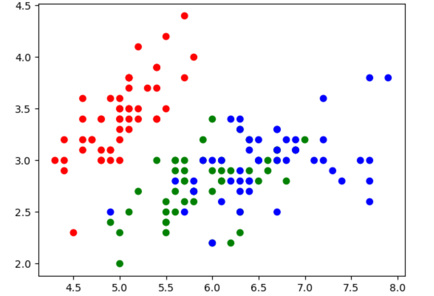

# FeedForwardNN_Classification

# Goal of the model:
Prepare the neural network for defining the data it will receive and initializing its internal parameters and classify the various species of Iris Dataset using color mapping.

# What the model does
This code implements a basic neural network architecture with one hidden layer and uses the Adam optimizer for training. 
The model includes the following functionalities:
1.Loading and Preprocessing the Iris Dataset
2.Defining the Neural Network Class
3.Forward Propagation
4.Training the Model
5.Visualization

# Scatter Plot

The following can be observed from the scatter plot:
### Red: Iris Setosa 
### Green: Iris Versicolor
### Blue: Iris Virginica

